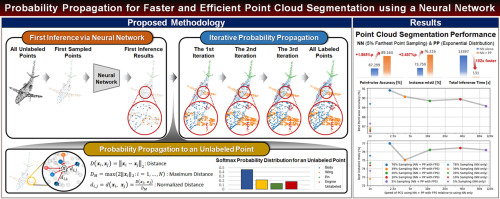

# Probability Propagation for Point Cloud Segmentation (PP-PCS) 
Official Implementation of the **"Probability Propagation for Faster and Efficient Point Cloud Segmentation using a Neural Network (Accepted at PRL 2023)"**.



[[Paper]](https://doi.org/10.1016/j.patrec.2023.04.010)


# Updates & TODO Lists
- [] Update env install file 


# Getting Started
## Environment Setup
- Tested on RTX 3090 with python 3.7, pytorch 1.8.0, torchvision 0.9.0, CUDA 11.2

## Training PointNet++ from-scratch

1. Download original PointNet ++ repository(Pytorch Implementation)

```
git clone https://github.com/yanx27/Pointnet_Pointnet2_pytorch.git
```

2. Download the ShapeNet dataset from [[Here]](https://shapenet.cs.stanford.edu/media/shapenetcore_partanno_segmentation_benchmark_v0_normal.zip) 

3. Trainig PointNet++ with ShapeNet
 - $ckp_root : where to save checkpoint 

```
cd Pointnet_Pointnet2_pytorch/
python train_partseg.py --model pointnet2_part_seg_msg --normal --log_dir $ckp_root
```

## Checkpoints 
We provide a total of 15 checkpoints that represent the best performance achieved during 300 epochs. These checkpoints were generated using three different point cloud sampling methods (FPS, Poisson, Random) and five different numbers of sampled points (2048, 1024, 512, 256, 128).

```
cd checkpoints/
```


## How to Run Probability Propagation (PP)

1. Download code zip file and unzip or clone our repository

 - download the pretrained models in folder (PP-PCS/pretrained_models)
 - or you can train PointNet++ network from-scratch following upper discription

2. Evaluate part-segmentation with PP method

- $d_cutoff_start : start point of effective distance ratio for part-segmentation
- $d_cutoff_end : end point of effective distance ratio for part-segmentation 

```
cd PP-PCS

# example: evaluate the performance in the part-segmentation with the range of distance ratio 38 to 44 
python part_segmentation_w_pp.py --d_cutoff_start 38 --d_cutoff_end 44
```

3. Output
Epoch | Sampling method | number of points | probability mapping, distance ratio | Neural Network performance | Probability Propagation performance |


4. Results
| \multirow{2}{*}{\begin{tabular}[c]{@{}c@{}}\textbf{Sampling} |
|--------------------------------------------------------------|
|                                                              |                | Cap            | Rocket         | Skateboard     | Mug            | Laptop         | Car            | Pistol         | Guitar         | Airplane       | Chair          | Motorbike      | Table          | Knife          | Lamp           | Earphone       |                |
| \multirow{2}{*}{\textbf{5\%}}                                | \textbf{NN}    | \textbf{60.61} | \textbf{38.95} | \textbf{68.92} | \textbf{80.55} | \textbf{95.07} | \textbf{60.26} | \textbf{74.16} | \textbf{84.22} | 62.85          | 84.71          | 30.21          | 77.52          | 77.90          | 72.98          | 52.17          | 75.62          |
|                                                              | \textbf{NN+PP} | 57.46          | 36.78          | 68.07          | 79.98          | 93.76          | 59.11          | 73.66          | 84.13          | \textbf{62.86} | \textbf{86.49} | \textbf{31.54} | 7\textbf{9.50} | \textbf{80.81} | \textbf{80.50} | \textbf{69.04} | \textbf{77.43} |
| \multirow{2}{*}{\textbf{10\%}}                               | \textbf{NN}    | \textbf{60.82} | \textbf{46.22} | 68.10          | \textbf{78.09} | \textbf{95.18} | \textbf{55.69} | \textbf{71.86} | 87.80          | 61.98          | 86.85          | 25.19          | 77.56          | 80.58          | 75.47          | 63.22          | 76.27          |
|                                                              | \textbf{NN+PP} | 55.95          | 44.67          | \textbf{68.49} | 77.20          | 94.70          | 54.33          | 70.82          | \textbf{87.81} | \textbf{62.29} | \textbf{87.21} | \textbf{28.30} | \textbf{79.35} | \textbf{82.66} | \textbf{79.20} | \textbf{68.41} | \textbf{77.20} |
| \multirow{2}{*}{\textbf{20\%}}                               | \textbf{NN}    | \textbf{57.96} | \textbf{56.62} | \textbf{71.21} | 79.62          | \textbf{95.25} | \textbf{58.07} | \textbf{77.42} | 87.13          | 63.20          | 86.57          | 30.27          | 78.64          | 80.90          | 77.41          | 68.22          | 77.23          |
|                                                              | \textbf{NN+PP} | 56.57          | 55.64          | 69.90          | \textbf{79.67} | 94.82          | 57.63          | 77.28          | \textbf{87.20} | \textbf{63.20} | \textbf{86.90} | \textbf{30.73} | \textbf{79.44} | \textbf{81.79} | \textbf{79.58} | \textbf{69.69} | \textbf{77.79} |
| \multirow{2}{*}{\textbf{39\%}}                               | \textbf{NN}    | \textbf{61.59} | \textbf{49.92} | \textbf{69.95} | \textbf{63.10} | \textbf{94.54} | 58.93          | \textbf{75.97} | \textbf{88.08} | 65.94          | 87.08          | 35.80          | 78.62          | 80.12          | 78.58          | 73.21          | 77.72          |
|                                                              | \textbf{NN+PP} | 60.69          | 49.25          | 68.97          | 61.74          | 94.17          | \textbf{59.06} | 75.81          | 87.98          | \textbf{66.17} | \textbf{87.95} | \textbf{36.39} | \textbf{79.55} | \textbf{80.36} | \textbf{79.24} | \textbf{73.93} | \textbf{78.24} |
| \multirow{2}{*}{\textbf{78\%}}                               | \textbf{NN}    | 66.04          | \textbf{50.53} | \textbf{69.40} | \textbf{88.67} | 94.94          | 56.96          | \textbf{73.81} | \textbf{86.23} | 68.03          | 86.63          | 33.79          | 77.68          | 77.69          | 78.14          | \textbf{67.12} | 77.55          |
|                                                              | \textbf{NN+PP} | \textbf{66.13} | 50.31          | 69.09          | 88.45          | \textbf{94.94} | \textbf{57.54} | 73.78          | 86.09          | \textbf{68.51} | \textbf{87.17} | \textbf{33.87} | \textbf{78.26} | \textbf{77.85} | \textbf{78.64} | 67.11          | \textbf{78.00} |
| \multirow{2}{*}{\begin{tabular}[c]{@{}c@{}}\textbf{Sampling} |
|                                                              |                | 5\%            | 10\%           | 20\%           | 39\%           | 78\%           |
| \multirow{3}{*}{\begin{tabular}[c]{@{}c@{}}\textbf{Random}   |
|                                                              | \textbf{NN+PP} | 0.153          | 0.141          | 0.203          | 0.243          | 0.264          |
|                                                              | NN/(NN+PP)     | 31.810         | 16.641         | 6.112          | 2.079          | 1.087          |
| \multirow{3}{*}{\begin{tabular}[c]{@{}c@{}}\textbf{Farthest} |
|                                                              | \textbf{NN+PP} | 0.046          | 0.070          | 0.134          | 0.198          | 0.206          |
|                                                              | NN/(NN+PP)     | 102.267        | 36.649         | 10.875         | 4.016          | 2.184          |
| \multirow{3}{*}{\begin{tabular}[c]{@{}c@{}}\textbf{Poisson}  |
|                                                              | \textbf{NN+PP} | 0.048          | 0.071          | 0.110          | 0.171          | 0.225          |
|                                                              | NN/(NN+PP)     | 57.659         | 16.415         | 6.311          | 1.927          | 0.923          |
